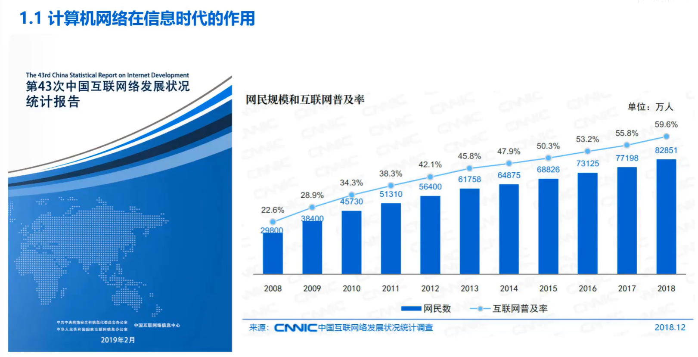
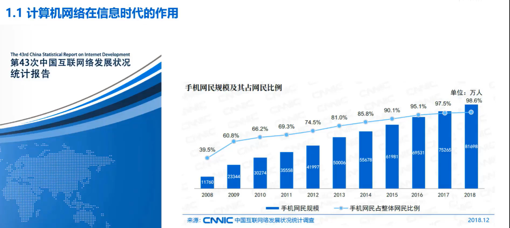
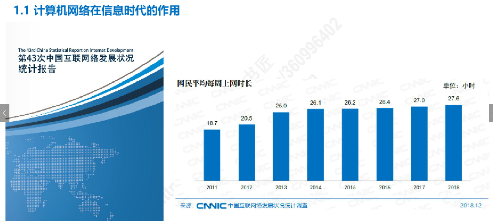
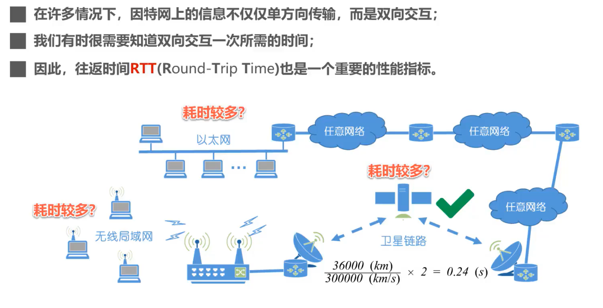
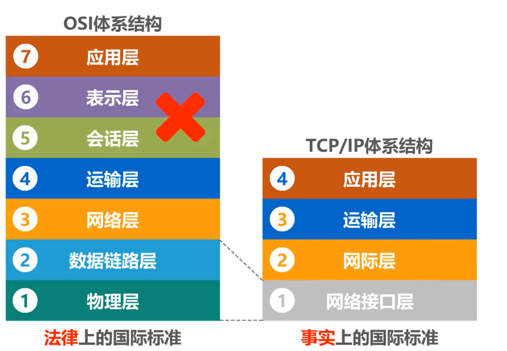
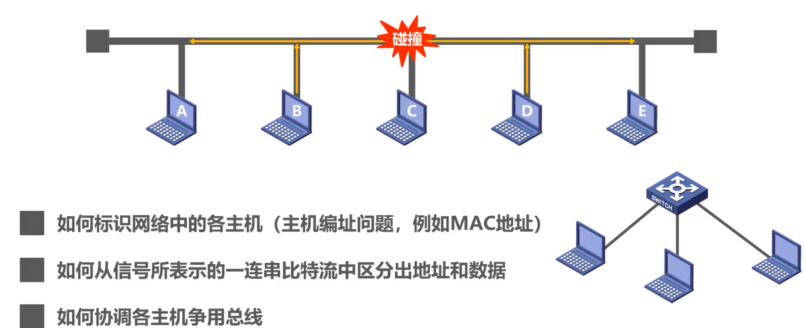
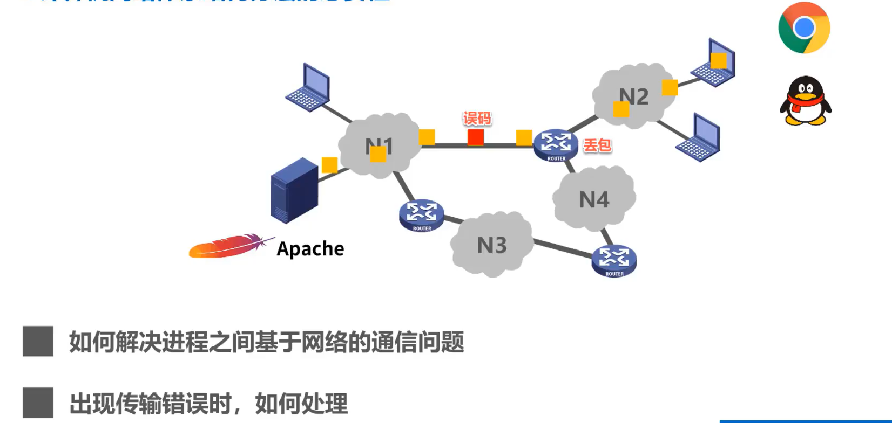
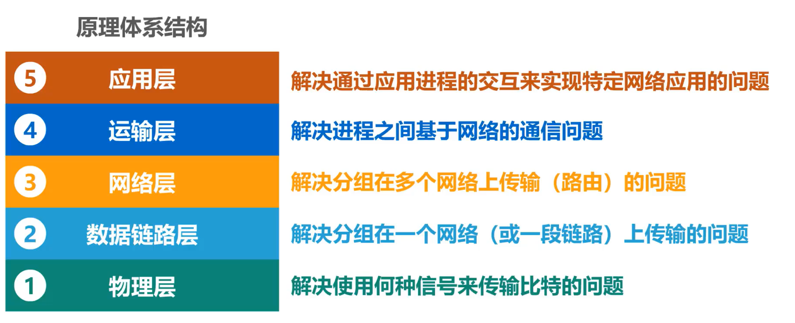
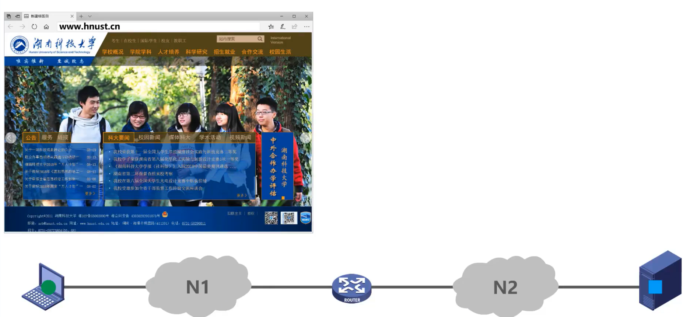
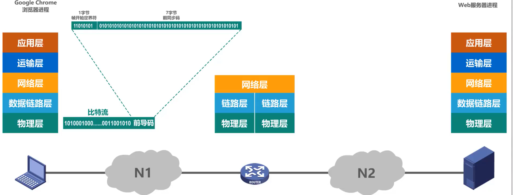

# 图示说明

``代表着主机

`` 代表服务器

`` 代表着路由器

``代表着网络

# 1.1、计算机网络在信息时代的作用

* 计算机网络已由一种**通信基础设施**发展成为一种重要的**信息服务基础设施**
* 计算机网络已经像水，电，煤气这些基础设施一样，成为我们**生活中不可或缺**的一部分

## 我国互联网发展状况

[中国互联网络信息中心CNNIC](http://www.cnnic.net.cn)

---

# 1.2、因特网概述

## 1、网络、互连网（互联网）和因特网

网络：网络（Network）由若干**结点（Node）**和连接这些结点的**链路（Link）**组成。

互连网（互联网）：多个网络通过路由器互连起来，这样就构成了一个覆盖范围更大的网络，即互连网（互联网）。因此，互联网又称为“网络的网络（Network of Networks）”。

因特网：因特网（Internet）是世界上最大的互连网络（用户数以亿计，互连的网络数以百万计）。

> **internet与Internet的区别**
>
> * **internet(互联网或互连网)**是一个通用名词，它泛指**多个计算机网络互连而成的网络**。在这些网络之间的通信协议可以是任意的。
> * **Internet（因特网）则是一个专用名词**，它指**当前全球最大的、开放的、由众多网络互连而成的特定计算机网络**，它采用TCP/IP协议族作为通信的规则，其前身是美国的ARPANET。
>
> **任意把几个计算机网络互连起来（不管采用什么协议），并能够相互通信，这样构成的是一个互连网(internet) ，而不是互联网(Internet)。**

## 2、因特网发展的三个阶段

**因特网服务提供者 `ISP`(`I`nternet `S`ervice `P`rovider)**

> 普通用户是如何接入到因特网的呢？
>
> 答：**通过ISP接入因特网**
>
> ISP可以从因特网管理机构申请到成块的IP地址，同时拥有通信线路以及路由器等联网设备。任何机构和个人只需缴纳费用，就可从**ISP的得到所需要的IP地址**。
>
> **因为因特网上的主机都必须有IP地址才能进行通信，这样就可以通过该ISP接入到因特网**

**中国的三大 `ISP`：中国电信，中国联通和中国移动**

**基于ISP的三层结构的因特网**

> 一旦某个用户能够接入到因特网，那么他也可以成为一个ISP，所需要做的就是购买一些如调制解调器或路由器这样的设备，让其他用户可以和他相连。

## 3、因特网的标准化工作

* 因特网的标准化工作对因特网的发展起到了非常重要的作用。
* 因特网在指定其标准上的一个很大的特点是**面向公众。**
  * 因特网所有的**RFC**(Request For Comments)技术文档都可从因特网上免费下载；
  * 任何人都可以随时用电子邮件发表对某个文档的意见或建议。
* **因特网协会ISOC**是一个国际性组织，它负责对因特网进行全面管理，以及在世界范围内促进其发展和使用。
  * 因特网体系结构委员会IAB，负责管理因特网有关协议的开发；
  * 因特网工程部IETF，负责研究中短期工程问题，主要针对协议的开发和标准化；
  * 因特网研究部IRTF，从事理论方面的研究和开发一些需要长期考虑的问题。

* 制订因特网的正式标准要经过一下**4个阶段**：

  1、因特网草案（在这个阶段还不是RFC文档）

  2、建议标准（从这个阶段开始就成为RFC文档）

  3、草案标准

  4、因特网标准

## 4、因特网的组成

* 边缘部分

  由所有连接在因特网上的**主机**组成（台式电脑，大型服务器，笔记本电脑，平板，智能手机等）。这部分是**用户直接使用**的，用来进行**通信**（传送数据、音频或视频）和**资源共享**。
* 核心部分

  由**大量网络**和连接这些网络的**路由器**组成。这部分是**为边缘部分提供服务**的（提供连通性和交换）。

> 路由器是一种专用计算机，但我们不称它为主机，路由器是实现分组交换的关键构建，其任务是转发收到的分组，这是网络核心最重要的部分。
>
> 处在互联网边缘的部分就是连接在互联网上的所有的主机。这些主机又称为**端系统 (end system)**。
>
> **端系统在功能上可能有很大的差别：**
>
> 1. 小的端系统可以是一台普通个人电脑，具有上网功能的智能手机，甚至是一个很小的网络摄像头。
> 2. 大的端系统则可以是一台非常昂贵的大型计算机。
> 3. 端系统的拥有者可以是个人，也可以是单位（如学校、企业、政府机关等），当然也可以是某个ISP。

### 补充：

**端系统之间通信的含义**

“主机 A 和主机 B 进行通信”实际上是指：“运行在主机 A 上的某个程序和运行在主机 B 上的另一个程序进行通信”。**即“主机** **A** **的某个进程和主机** **B** **上的另一个进程进行通信”。简称为“计算机之间通信”。**

端系统之间的通信方式通常可划分为两大类：

**客户-服务器方式：**

* 客户 (client) 和服务器 (server) 都是指通信中所涉及的两个应用进程。
* 客户 - 服务器方式所描述的是进程之间服务和被服务的关系。
* 客户是服务的请求方，服务器是服务的提供方。

> **服务请求方和服务提供方都要使用网络核心部分所提供的服务。**

**对等连接方式：**

* **对等连接** (peer-to-peer，简写为 **P2P** ) 是指两个主机在通信时并不区分哪一个是服务请求方还是服务提供方。
* 只要两个主机都运行了对等连接软件 ( P2P 软件) ，它们就可以进行**平等的、对等连接通信**。
* 双方都可以下载对方已经存储在硬盘中的共享文档。

---

# 1.3 三种交换方式

网络核心部分是互联网中最复杂的部分。

网络中的核心部分要向网络边缘中的大量主机提供连通性，使边缘部分中的任何一个主机都能够向其他主机通信（即传送或接收各种形式的数据）。

在网络核心部分起特殊作用的是**路由器**(router)。

**路由器**是实现**分组交换** (packet switching) 的关键构件，其任务是**转发**收到的分组，这是网络核心部分最重要的功能。

## 1、电路交换（Circuit Switching）

> 传统两两相连的方式，当电话数量很多时，电话线也很多，就很不方便
>
> 所以要使得每一部电话能够很方便地和另一部电话进行通信，就应该使用一个**中间设备**将这些电话连接起来，这个中间设备就是**电话交换机**

* 电话交换机接通电话线的方式称为电路交换；
* 从通信资源的分配角度来看，交换（Switching）就是按照某种方式动态地分配传输线路的资源；
* 电路交换的三个步骤：

  1、建立连接（分配通信资源）

  2、通话（一直占用通信资源）

  3、释放连接（归还通信资源）

> 当使用电路交换来传送计算机数据时，其线路的传输效率往往很低。
>
> 这是因为计算机数据是突发式地出现在传输线路上的。
>
> 所以计算机通常采用的是**分组交换**，而不是线路交换

## 2、分组交换（Packet Switching）

> 通常我们把表示**该消息的整块数据**成为一个**报文**。
>
> 在发送报文之前，先把较长的报文划分成一个个更小的**等长数据段**，在每一个数据段前面。加上一些由必**要的控制信息组成的首部**后，就构成一个分组，也可简称为“包”，相应地，首部也可称为“包头”。
>
> 首部包含了**分组的目的地址**
>
> 分组从源主机到目的主机，可走不同的路径。

发送方

* 构造分组
* 发送分组

路由器

* 缓存分组
* 转发分组
* 简称为“分组转发”

> 在路由器中的输入和输出端口之间没有直接连线。
>
> 路由器处理分组的过程是：
>
> 1. 把收到的分组先**放入缓存（暂时存储）；**
> 2. **查找转发表**，找出到某个目的地址应从哪个端口转发；
> 3. 把分组送到适当的端口**转发**出去。

接收方

* 接收分组
* 还原报文

## 3、报文交换（Message Switching）

报文交换中的交换结点也采用存储转发方式，但报文交换对报文的大小没有限制，这就要求交换结点需要较大的缓存空间。报文交换主要用于早期的电报通信网，现在较少使用，**通常被较先进的分组交换方式所取代**。

## 三种交换方式的对比

> 假设A，B，C，D是分组传输路径所要经过的4个结点交换机，纵坐标为时间

分析：

电路交换：

* 通信之前首先要建立连接；连接建立好之后，就可以使用已建立好的连接进行数据传送；数据传送后，需释放连接，以归还之前建立连接所占用的通信线路资源。
* 一旦建立连接，中间的各结点交换机就是直通形式的，比特流可以直达终点；

报文交换：

* 可以随时发送报文，而不需要事先建立连接；整个报文先传送到相邻结点交换机，全部存储下来后进行查表转发，转发到下一个结点交换机。
* 整个报文需要在各结点交换机上进行存储转发，由于不限制报文大小，因此需要各结点交换机都具有较大的缓存空间。

分组交换：

* 可以随时发送分组，而不需要事先建立连接。构成原始报文的一个个分组，依次在各结点交换机上存储转发。各结点交换机在发送分组的同时，还缓存接收到的分组。
* 构成原始报文的一个个分组，在各结点交换机上进行存储转发，相比报文交换，减少了转发时延，还可以避免过长的报文长时间占用链路，同时也有利于进行差错控制。

---

# 1.4 计算机网络的定义和分类

## 定义

* 计算机网络的精确定义并未统一
* 计算机网络的最简单的定义是：一些**互**相**连**接的、**自治**的计算机的**集合**。
  * 互连：是指计算机之间可以通过有线或无线的方式进行数据通信；
  * 自治：是指独立的计算机，他有自己的硬件和软件，可以单独运行使用；
  * 集合：是指至少需要两台计算机；
* 计算机网络的较好的定义是：计算机网络主要是由一些**通用的，可编程的硬件（一定包含有中央处理机CPU）互连**而成的，而这些硬件并非专门用来实现某一特定目的（例如，传送数据或视频信号）。这些可编程的硬件能够用来**传送多种不同类型的数据**，并能**支持广泛的和日益增长的应用**。
  * 计算机网络所连接的硬件，并不限于一般的计算机，而是包括了智能手机等智能硬件。
  * 计算机网络并非专门用来传送数据，而是能够支持很多种的应用（包括今后可能出现的各种应用）。

## 分类

**按交换技术分类：**

* 电路交换网络
* 报文交换网络
* 分组交换网络

**按使用者分类：**

* 公用网
* 专用网

**按传输介质分类：**

* 有线网络
* 无线网络

**按覆盖范围分类：**

* 广域网WAN（Wide Area Network）

作用范围通常为几十到几千公里，因而有时也称为远程网（long haul network）。广域网是互联网的核心部分，其任务是通过长距离（例如，跨越不同的国家）运送主机所发送的数据。

* 城域网MAN

作用范围一般是一个城市，可跨越几个街区甚至整个城市

* 局域网LAN

一般用微型计算机或工作站通过高速通信线路相连（速率通常在 10 Mbit/s 以上），但地理上范围较小（1 km 左右）

* 个域网PAN

就是在个人工作的地方把个人使用的电子设备用无线技术连接起来的网络。

**按拓扑结构分类：**

* 总线型网络

* 星型网络

* 环形网络

* 网状型网络

---

# 1.5 计算机网络的性能指标

## 速率

## 带宽

## 吞吐量

> 带宽1 Gb/s的以太网，代表其额定速率是1 Gb/s，这个数值也是该以太网的**吞吐量的绝对上限值**。因此，对于带宽1 Gb/s的以太网，可能实际吞吐量只有 700 Mb/s，甚至更低。
>
> 注意：吞吐量还可以用每秒传送的字节数或帧数表示

## 时延

时延时指数据（一个报文或分组，甚至比特）从网络（或链路）的一端传送到另一端所需的时间。

网络时延由几部分组成：

* 发送时延

主机或路由器发送数据帧所需要的时间，也就是从发送数据帧的第一个比特算起，到该帧的最后一个比特发送完毕所需的时间。

* 传播时延

电磁波在信道中传播一定的距离需要花费的时间。

* 处理时延

主机或路由器在收到分组时要花费一定时间进行处理

* 排队时延

分组在进过网络传输时，要经过许多路由器。但分组在进入路由器后要先在输入队列中排队等待处理。

> 有时会把排队时延看成**处理时延 一部分**
>
> 总时延 = 发送时延 + 传播时延 + 处理时延 （处理时延 + 排队时延）

> 当处理时延忽略不计时，发送时延 和 传播时延谁占主导，要具体情况具体分析

## 时延带宽积

时延带宽积 = 传播时延 * 带宽

## 往返时间

互联网上的信息不仅仅单方向传输而是双向交互的。因此，我们有时很需要知道**双向交互一次所需的时间**。

## 利用率

利用率有**信道利用率**和**网络利用率**两种。

  

## 丢包率

---

# 1.6 计算机网络体系结构

## 1、常见的计算机网络体系结构

> 如今用的最多的是TCP/IP体系结构，现今规模最大的、覆盖全球的、基于TCP/IP的互联网并未使用OSI标准。
>
> TCP/IP体系结构相当于将OSI体系结构的**物理层**和**数据链路层**合并为了**网络接口层**，并去掉了**会话层**和**表示层**。
>
> TCP/IP在网络层使用的协议是IP协议，IP协议的意思是网际协议，因此**TCP/IP体系结构的网络层称为网际层**

> 在用户主机的操作系统中，通常都带有符合TCP/IP体系结构标准的TCP/IP协议族。
>
> 而用于网络互连的路由器中，也带有符合TCP/IP体系结构标准的TCP/IP协议族。
>
> 只不过路由器一般只包含网络接口层和网际层。

> **网络接口层**：并没有规定具体内容，这样做的目的是可以互连全世界各种不同的网络接口，例如：有线的以太网接口，无线局域网的WIFI接口等。
>
> **网际层**：它的核心协议是IP协议。
>
> **运输层**：TCP和UDP是这层的两个重要协议。
>
> **应用层**：这层包含了大量的应用层协议，如 HTTP , DNS 等。

> **IP协议（网际层）**可以将不同的**网络接口（网络接口层）**进行互连，并向其上的**TCP协议和UDP协议（运输层）**提供网络互连服务
>
> 而**TCP协议**在享受IP协议提供的网络互连服务的基础上，可向**应用层的相应协议**提供**可靠**的传输服务。
>
> **UDP协议**在享受IP协议提供的网络互连服务的基础上，可向**应用层的相应协议**提供**不可靠**的传输服务。

> TCP/IP体系结构中最重要的是**IP协议**和**TCP协议**，因此用TCP和IP来表示整个协议大家族。

> 教学时把TCP/IP体系结构的**网络接口层**分成了**物理层**和**数据链路层**

## 2、计算机网络体系结构分层的必要性

**物理层问题**

> 这图说明
>
> * 第一，严格来说，传输媒体并不属于物理层
> * 计算机传输的信号，并不是图示的方波信号
>
> 这样举例只是让初学者容易理解

**数据链路层问题**

**网络层问题**

**运输层问题**

> 如何标识与网络通信相关的应用进程：一个分组到来，我们应该交给哪个进程处理呢？浏览器进程还是QQ进程

**应用层问题**

> 应用层该用什么方法（应用层协议）去解析数据

**总结**

## 3、计算机网络体系结构分层思想举例

例子：主机的浏览器如何与Web服务器进行通信

**解析：**

主机和Web服务器之间基于网络的通信，实际上是主机中的**浏览器应用进程**与Web服务器中的**Web服务器应用进程**之间基于**网络的通信**

**体系结构的各层在整个过程中起到怎样的作用？**

**1、发送方发送**

> 第一步：
>
> * **应用层**按照HTTP协议的规定构建一个**HTTP请求报文**
> * 应用层将**HTTP请求报文**交付给**运输层**处理

> 第二步：
>
> * **运输层**给**HTTP请求报文**添加一个**TCP首部**，使之成为**TCP报文段**
> * **TCP报文段的首部格式**作用是区分应用进程以及实现可靠传输
> * **运输层**将T**CP报文段**交付给**网络层**处理

> 第三步：
>
> * **网络层**给**TCP报文段**添加一个**IP首部**，使之成为**IP数据报**
> * **IP数据报的首部格式**作用是使**IP数据报**可以在互联网传输，也就是被路由器转发
> * **网络层**将**IP数据报**交付给**数据链路层**处理

> 第四步：
>
> * **数据链路层**给**IP数据报**添加一个**首部**和一个**尾部**，使之成为**帧**     （图示右边为首部，左边为尾部）
> * 该**首部**的作用主要是为了让**帧**能够在一段链路上或一个网络上传输，能够被相应的目的主机接收
> * 该**尾部**的作用是让目的主机检查所接收到的**帧**是否有误码
> * **数据链路层**将**帧**交付给**物理层**

> 第五步：
>
> * **物理层**先将**帧**看做是**比特流**，这里的网络N1假设是以太网，所以**物理层**还会给该**比特流**前面添加**前导码**
> * **前导码**的作用是为了让目的主机做好接收帧的准备
> * **物理层**将装有**前导码**的**比特流**变换成相应的**信号**发送给传输媒体

> 第六步：
>
> * **信号**通过**传输媒体**到达**路由器**

**2、路由器转发**

> 在路由器中
>
> * **物理层**将**信号**变为**比特流**，然后去掉**前导码**后，将其交付给**数据链路层**
> * **数据链路层**将**帧**的**首部**和**尾部**去掉后，将其交付给**网络层**，这实际交付的是**IP数据报**
> * **网络层**解析**IP数据报**的**首部**，从中提取**目的网络地址**

> 在路由器中
>
> * 提取**目的网络地址**后查找**自身路由表**。确定**转发端口**， 以便进行转发
> * **网络层**将**IP数据报**交付给**数据链路层**
> * **数据链路层**给**IP数据报**添加一个**首部**和一个**尾部**，使之成为**帧**
> * **数据链路层**将帧交付给**物理层**
> * **物理层**先将**帧**看成**比特流**，这里的网络N2假设是以太网，所以**物理层**还会给该**比特流**前面添加**前导码**
> * 物理层将装有**前导码**的**比特流**变换成相应的**信号**发送给传输媒体，信号通过传输媒体到达**Web服务器**

**3、接收方接收**

> 和发送方（主机）发送过程的封装正好是反着来
>
> 在Web 服务器上
>
> * **物理层**将**信号**变换为**比特流**，然后去掉**前导码**后成为**帧**，交付给**数据链路层**
> * **数据链路层**将**帧**的**首部**和**尾部**去掉后成为**IP数据报**，将其交付给**网络层**
> * **网络层**将**IP数据报**的**首部**去掉后成为**TCP报文段**，将其交付给**运输层**
> * **运输层**将**TCP报文段**的**首部**去掉后成为**HTTP请求报文**，将其交付给**应用层**
> * **应用层**对**HTTP请求报文**进行**解析**，然后给主机发回**响应报文**
>
> **发回响应报文的步骤和之前过程类似**

## 4、计算机网络体系结构中的专用术语

以下介绍的专用术语来源于OSI的七层协议体系结构，但也适用于TCP/IP的四层体系结构和五层协议体系结构

**实体**

**协议**

> 协议：控制两个对等实体进行逻辑通信的规则的集合
>
> 协议三要素：
>
> * 语法：定义所交换信息的格式
> * 语义：定义收发双方所要完成的操作
> * 同步：定义收发双发的时序关系

**服务**

