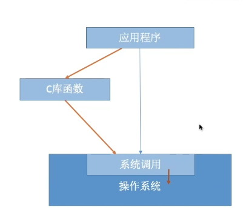

系统调用：

操作系统作为用户和计算机硬件之间的接口，需要向上提供一些简单易用的服务。主要包括命令接口和程序接口。其中，**程序接口**由**一组系统调用**组成。

应用程序通过**系统调用**请求操作系统的服务。而系统中的各种共享资源都由操作系统内核统一掌管，因此凡是**与共享资源有关的操作(如存储分配、I/O操作、文件管理等)**，都必须**通过系统调用的方式**向**操作系统内核提出服务请求**，由操作系统内核代为完成。这样可以**保证系统的稳定性和安全性**，防止用户进行非法操作。

系统调用的过程：

1.传参

2.陷入指令/Trap/访管

3.由操作系统内核程序处理系统调用请求

4.返回应用程序
